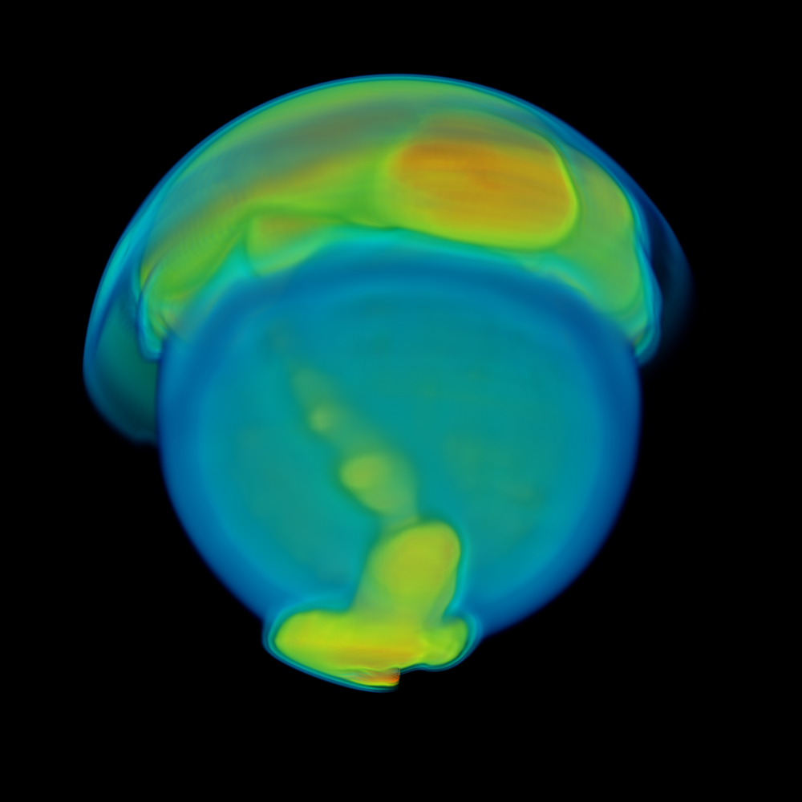

# Astro

This project implements a ray marching algorithm to visualize a star using the Visualization Toolkit (VTK). The renderer tests for intersections between a ray cast by the camera and the render object. It takes samples along the path of the ray, applies the corresponding transfer function if there is a hit, and performs color correction.
The transfer function maps values to the desired region, reflecting the specific visualization task. Multiple transfer functions are built for different visualization purposes.

For example, a two-dimensional transfer function is developed that utilizes the gradient magnitude to indicate regions of change by calculating the first derivative. 

The following image is the rendered result with 256 samples and a resolution of 300x300 pixels.

 
